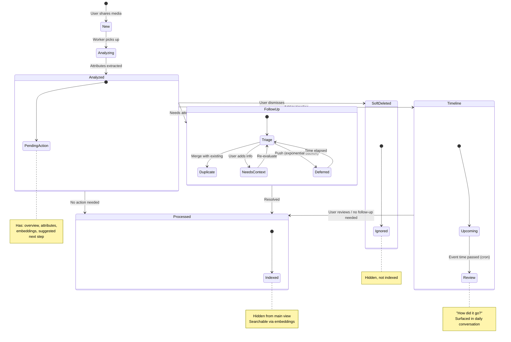

# Item Lifecycle

## New Item
An item is created when a user shares a media snippet. It is unanalyzed and has no next steps.

## Item Analysis
A worker process asynchronously analyzes the item. The item is marked as analyzed and has a next step and an overview.

During Analysis, the item has attributes extracted from the media snippet. These attributes are used to determine the next step.
Attributes include:
- date and time
- location (physical or virtual)
- principals (people)
- subject (what the media snippet is about)
- overview (summary of the media snippet)

The attributes are used to create embeddings for the item. The embeddings are used to find similar items and detect duplicates.
The attributes are also used to create the overview and should be used to search in the UIs.

### Next Steps
- Add to timeline
- Follow up
  - Is this a duplicate with another item?
  - Add context because I'm not sure what this is about 
  - Push (ask user again later, exponential backoff)
  - Processed (hide, add embeds, add to search index)
  - Soft Delete (hide and ignore)

## Item Processed
The item is hidden, has embeddings, and is added to the search index.

## Item Soft Deleted
The item is hidden and ignored.

## State Machine

