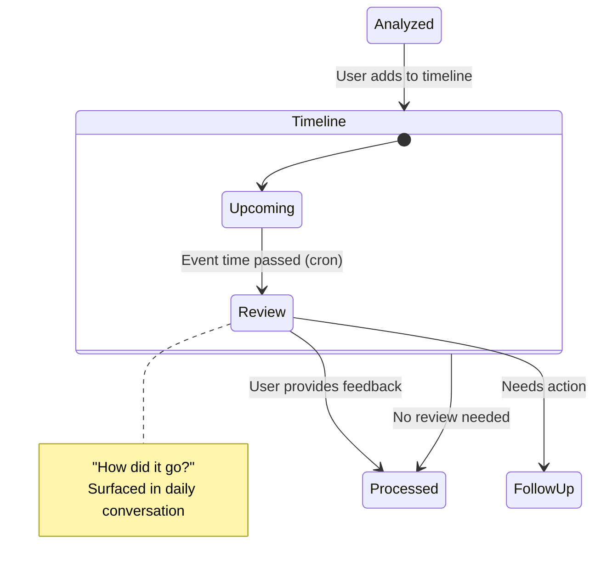

# Timeline Feature

## Overview
The Timeline is a UI component that displays items plotted by their **referenced time** - the date/time the item refers to, not when it was shared. This gives users a chronological view of events, meetings, deadlines, and other time-based content they've captured.

## Core Concept
When a user shares a media snippet (screenshot, photo, etc.), the analysis worker extracts a `date_time` attribute. This represents when the event/item occurs in the real world:

- Screenshot of a calendar invite → plotted at the meeting time
- Photo of a concert ticket → plotted at the event date
- Screenshot of a deadline reminder → plotted at the due date

## UI Behavior

### Zoomable Navigation
The timeline supports multiple zoom levels:

| Zoom Level | View | Use Case |
|------------|------|----------|
| Day | Hourly slots | Detailed daily schedule |
| Week | Daily columns | Weekly planning |
| Month | Day cells | Monthly overview |
| Year | Month blocks | Long-term view |

### Default View
The timeline defaults to a **future-focused view** (week or month ahead), showing upcoming items. This makes it immediately useful for "what's coming up?"

### Navigation
Users can:
- Scroll backward to view past items
- Scroll forward to see further into the future
- Zoom in/out at any point in time (past or future)

### Current Time Indicator
A "now" line shows the current moment, helping users orient between past and upcoming items.

### Item Display
Items on the timeline show:
- Title/overview (from analysis)
- Time placement (vertical or horizontal based on zoom)
- Visual indicator of item type (meeting, deadline, event, etc.)
- Quick actions (view details, mark processed, dismiss)

## State Machine Context
Items reach the Timeline from the `Analyzed` state when the user chooses "Add to timeline" as the next step. See [Item Lifecycle](./item-lifecycle.md) for full state details.

### Time-Based Transition
A scheduled job (cron) checks for timeline items where `date_time < now`. These items transition from `Upcoming` to `Review` and are queued for the daily user conversation.

### Daily Conversation
The system initiates a daily check-in with the user to:
1. Review past events ("How did the meeting go?")
2. Surface items needing attention
3. Collect feedback that enriches the item (notes, outcomes, follow-ups)

This keeps items from silently aging out and captures valuable context while memories are fresh.

## Data Requirements
For an item to appear on the timeline, analysis must extract:

| Field | Required | Description |
|-------|----------|-------------|
| `date_time` | Yes | When the event occurs |
| `overview` | Yes | Display text |
| `duration` | No | Length of event (for rendering) |
| `location` | No | Where (physical/virtual) |
| `principals` | No | People involved |

## Open Questions
- [ ] How to handle items with date ranges vs. single points in time?
- [ ] Should recurring events be expanded or shown as a single item?
- [ ] What happens to timeline items after their date passes? Auto-archive?
- [ ] How to handle items with ambiguous dates ("next Tuesday")?
