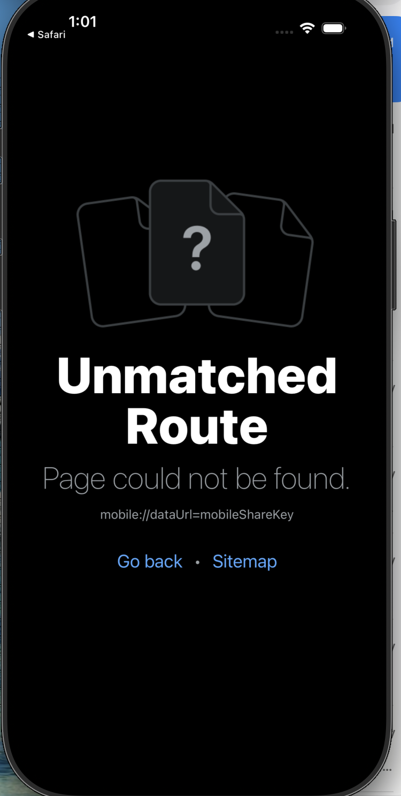

# Mobile

- We need an icon for the app. 
- The app should keep a list of shared items locally.
- The list should be ordered by date.
- The list should be scrollable.
- Items should be able to be shared again from the app.
- Items should be able to be deleted from the list.

## IOS

- Route error message when sharing content to the app.

## Android